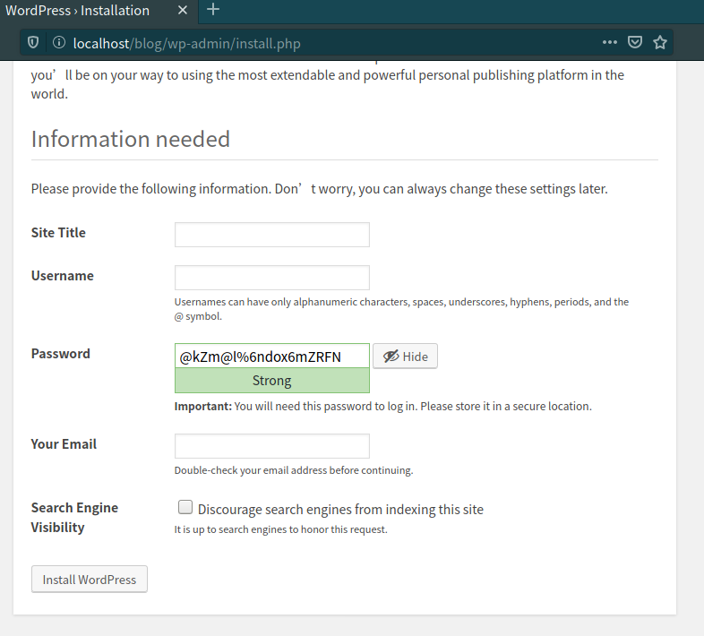
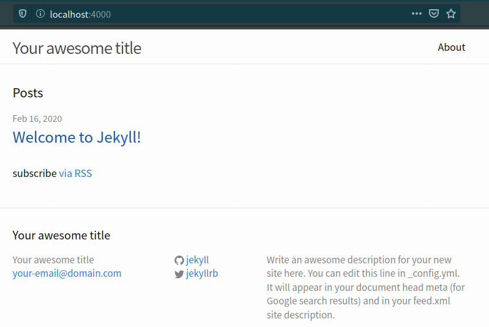

# 网上冲浪与建站

!!! abstract "导言"

    很多 Linux 的初学者都会对以下这些问题感到迷惑

    - 在命令行黑乎乎的窗口，我要怎么下载文件？

    - 在命令行下，下载任务可以放在后台吗？如果我在命令行下结束下载任务，会不会使已下载部分全部白费？

    下面内容可以解答你的疑问。

## 网络下载 {#download-utils}

### 为何使用 wget 和 cURL {#why-wget-and-curl}

在 Windows 下，很多人下载文件时会使用「迅雷」、「QQ 旋风」（停止运营）、「IDM」之类的软件来实现下载。那么在 Linux 环境下呢？在终端下，没有可视化软件提供点击下载。即使有桌面环境，有 Firefox 可以很方便地下载文件，硬件资源也会被很多不必要的服务浪费。通过以下内容讲述的 wget (`wget`) 和 cURL (`curl`) 工具，我们可以 Linux 上进行轻量的下载活动。

### Wget {#wget}

`wget` 是强力方便的下载工具，可以通过 HTTP 和 FTP 协议从因特网中检索并获取文件。

#### Wget 的特点 {#wget-features}

- 支持以非交互方式工作，能够在用户注销后在后台进行工作。

- 在不稳定的连接中依旧可以正常工作，支持断点续传功能。

- 支持 HTML 页面以及 FTP 站点的递归检索，您可以使用它来获取网站的镜像，或者像爬虫一样遍历网络。

- 在文件获取时可以增加时间标记，因此可以自动识别远程文件自上次检索后是否发生更改，并自动检索新版本。

- 支持代理服务器，以减轻网络负载，加快检索速度。

#### `wget` 使用 {#wget-usage}

使用 `man wget` 得到的结果为 `wget [option]... [URL]...`，其中的更多参数可以通过查看帮助 `wget -h` 来获取。

常用的选项

| 选项                         | 含义                                   |
| ---------------------------- | -------------------------------------- |
| `-i, --input-file=文件`      | 下载本地或外部文件中的 URL             |
| `-O, --output-document=文件` | 将输出写入文件                         |
| `-b, --background`           | 在后台运行 wget                        |
| `-d, --debug`                | 调试模式，打印出 wget 运行时的调试信息 |

??? example "范例"

	`$ wget -i filelist.txt` 批量下载 filelist.txt 中给出的链接

	`$ sh -c "$(wget https://raw.github.com/ohmyzsh/ohmyzsh/master/tools/install.sh -O -)"` 安装 oh-my-zsh

### cURL {#curl}

cURL (`curl`) 是一个利用 `URL` 语法在命令行下工作的文件传输工具，其中 c 意为 client。虽然 cURL 和 wget 基础功能有诸多重叠，如下载。但 cURL 由于可自定义各种请求参数，所以在模拟 web 请求方面更擅长；wget 由于支持 FTP 协议和递归遍历，所以在下载文件方面更擅长。

#### `curl` 使用 {#curl-usage}

同 `wget` 部分，我们可以查看帮助 `curl -h` 了解其用法。

常用的选项

| 选项 | 含义                                                      |
| ---- | --------------------------------------------------------- |
| `-o` | 把远程下载的数据保存到文件中，需要指定文件名              |
| `-O` | 把远程下载的数据保存到文件中，直接使用 URL 中默认的文件名 |
| `-I` | 只展示响应头内容                                          |

??? example "范例"

	`$ curl "http://cn.bing.com"` 会看到必应页面代码输出

	`$ curl "http://cn.bing.com" > bing.html` 把必应页面保存至 `bing.html` 本地，源码就被重定向到工作目录

	`$ curl -o bing.html "http://cn.bing.com"` 同时也可以使用 `-o` 选项指定输出文件

	`$ curl -O "https://lug.ustc.edu.cn/wiki/_media/wiki/logo.png"` 下载 LUG 的 logo

	`$ curl -I "http://cn.bing.com"` 只展示响应头内容

### 其他

除了 wget、curl，还有 mwget（多线程版本 wget）、axel、aria2（支持 BT 协议、支持 JSON-RPC 和 XML-RPC 接口远程调用）之类下载工具，其中 aria2 在 Windows 下使用也很广泛。


## 搭建简易的网站 {#website}

Linux 环境中较 Windows 更加容易搭建，仅需一两行命令，即可搭建成型的网站。

### WordPress

WordPress 是一个以 PHP 和 MySQL 为平台的自由开源的博客软件和内容管理系统。

由于 WordPress 是一个动态的博客软件，它需要涉及到一些数据库相关的配置和 HTTP 服务器的配置，这里我们给大家准备了一个 Ubuntu 安装 WordPress 的[自动配置脚本](wordpress.sh)。

!!! tips "提示"

	有兴趣自己配置的同学可以参阅补充材料。

下载脚本要使用 `curl` 命令，我们要先安装 curl。

```shell
$ sudo apt install curl
```

打开终端并运行

```shell
$ curl -fsSL https://101.ustclug.org/Ch02/wordpress.sh | sudo bash
```

等待片刻即可完成安装。

!!! warning "注意"

	这个脚本随机生成了 WordPress 数据库的密码并储存在了 `/root` 目录下。

最后我们打开浏览器并进入 `http://localhost/blog`

来完成最后的配置。



### Jekyll

Jekyll 是一个将纯文本转化为静态博客和网站的工具。

我们只需要通过命令行安装它。

```shell
$ sudo apt install jekyll
```

再输入几行命令用于创建网站

```shell
$ jekyll new my-awesome-site
$ cd my-awesome-site
$ jekyll serve
```

打开浏览器，在浏览器中输入 `localhost:4000` 进入我们搭建的网站。




## 引用来源 {#references .no-underline}

- [catonmat](https://catonmat.net/cookbooks)
- [vbird](http://cn.linux.vbird.org)
- [runoob](https://www.runoob.com/linux/linux-shell.html)
- [linuxde](https://man.linuxde.net)
