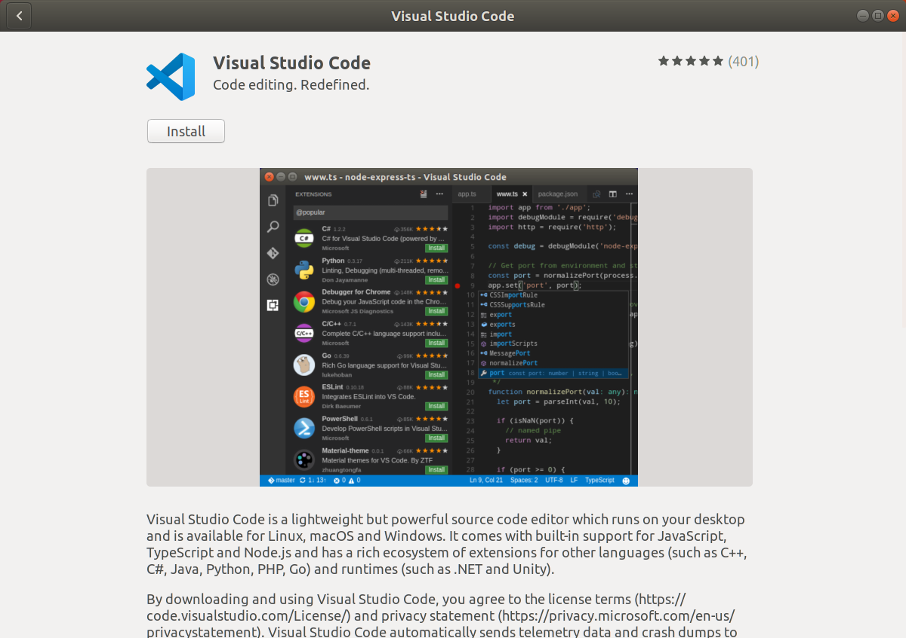
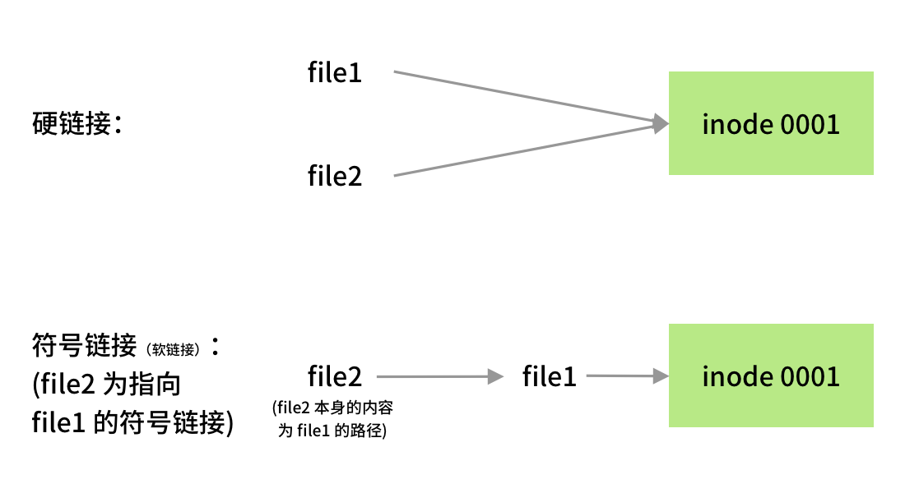

# 脚本与配置文件的编写与修改

!!! abstract "导言"

    很多 Linux 的初学者都会对以下这些问题感到迷惑

    - Bash 语法和 C 语言类似吗？和 Powershell 类似吗？

    - Bash script 出 bug 的时候我该如何调试呢？

    下面内容可以解答你的疑问。

    ## 软件安装 {#software-installation}

    软件安装的方法较多，这里将会提到几个比较有代表性的软件安装方法：

    ### 使用应用商店安装 {#use-app-store}

    使用应用商店安装比较符合我们在 Google Play 和 App Store 安装应用的习惯，无需用户的干预，只需轻点鼠标即可完成安装。

    在 Ubuntu 下，我们可以使用 Ubuntu Application Store 来进行安装，下图为应用商店中的 VSCode 应用页面。

    

    !!! info "其它发行版的应用商店"

        本节中提到的这种方法常见于自带应用商店的发行版，如 Ubuntu、Manjaro 等。

        在其他的发行版上，如果没有预装好的应用商店，可以通过安装 [snapcraft](https://snapcraft.io/) 获得应用商店。（Snap 商店在国内的访问速度较慢。）

    ### 使用包管系统安装 {#use-package-management-system}

    软件包管理器是一系列工具的集合，他自动化地完成软件的安装、更新、配置和移除功能。

    在 Linux 下，相比起使用应用商店安装软件，包管理系统的使用要更加广泛，许多软件均可以通过一行命令完成其安装，优雅而快速。

    软件包管理器一个十分重要的部分是软件仓库。软件仓库是收藏了互联网上可用软件包（应用程序）的图书馆，里面往往包含了数万个可供下载和安装的可用软件包。[^1]

    有了软件仓库这个部分，使得我们不需要手动下载大量的软件包到本地再通过包管理器进行安装。通过软件仓库的方法，我们只需要知道软件再软件仓库中的包名，即可让包管理器从网络中抓取到相应的软件包到本地，自动地进行安装。

    但是相比起使用应用商店的方法，使用这个软件仓库的方法需要预先知道所要的软件在软件仓库中的具体包名，没有应用商店帮助模糊搜索的功能。

    包管理系统有很多，比如管理 `deb` 软件包的 `dpkg` 以及它的前端 `apt`（使用于 `Debian` 系的系统）；`rpm` 包管理器以及它的前端 `dnf`（用于 `Fedora`）、前端 `yum` （用于 RedHat 系）等等。

    **为了方便讲述，本章下文中我们都将以 apt 作为典型实例进行讲解。**

    apt 的全称是 Advance Package Tool，是一个处理在 Debian、Ubuntu 或者其他衍生发行版的 Linux 上安装和移除软件的自由软件。

    apt 可以自动下载、配置和安装二进制或者源代码格式的软件包，简化了在这些发行版上管理软件的流程。因此，它常常用来安装软件、处理软件包之间的依赖关系、升级软件包乃至可以升级发行版，自动处理升级发行版所需的依赖关系等等。

    此外，由于可以自定义软件源，因此自由地添加第三方源可以达到安装官方软件源中没有的软件或者安装特定版本的目的。

    #### 搜索 {#apt-search}

    在安装前，使用 `apt search` 命令搜索软件仓库，查看对应的包名是否在软件仓库中。使用方法：`apt search 搜索内容`。

    下面是 `apt search firefox` 搜索火狐浏览器的输出结果示例，由于输出结果过多，去除了无用的其他软件包：

    ```text
    $ apt search firefox
    Sorting... Done
    Full Text Search... Done
    (Output omitted)

    firefox/bionic-updates,bionic-security,now 72.0.2+build1-0ubuntu0.18.04.1 amd64
      Safe and easy web browser from Mozilla

    (Output omitted)
    ```

    中间两行每个字段的含义：

    | 样例中的字段                             | 含义                                  |
    | ---------------------------------------- | ------------------------------------- |
    | `firefox`                                | 即为在软件仓库中的包名                |
    | `bionic-updates,bionic-security,now`     | 为包含这个软件包的仓库源              |
    | `72.0.2+build1-0ubuntu0.18.04.1`         | 为软件包的版本                        |
    | `amd64`                                  | 软件包的架构；还可能为`i386`、`all`等 |
    | `Safe and easy web browser from Mozilla` | 在软件仓库中对这个软件包的描述        |

    #### 安装 {#installation}

    在确定了软件包的包名后，可以通过 `apt install 包名` 进行安装。

    下面是 `apt install firefox` 安装火狐浏览器的输出结果示例。

    ```text
    # apt install firefox
    Reading package lists... Done
    Building dependency tree
    Reading state information... Done
    The following additional packages will be installed:
      adwaita-icon-theme at-spi2-core dconf-gsettings-backend dconf-service fontconfig
      (Output omitted)
    Suggested packages:
      fonts-lyx libasound2-plugins alsa-utils libcanberra-gtk0 libcanberra-pulse colord cups-common
      gvfs liblcms2-utils librsvg2-bin
    The following NEW packages will be installed:
      adwaita-icon-theme at-spi2-core dconf-gsettings-backend dconf-service firefox fontconfig
      (Output omitted)
    0 upgraded, 87 newly installed, 0 to remove and 1 not upgraded.
    Need to get 64.5 MB of archives.
    After this operation, 264 MB of additional disk space will be used.
    Do you want to continue? [Y/n]
    ```

    在运行结果中，会给出将会安装的软件包、下载大小以及安装后占用的大小。输入 `Y` 后回车确定进行安装。

    !!! tip "可能会出现的权限问题"
        在一般情况下，如果直接运行 `apt install` 命令，会输出
        ```text
        $ apt install firefox
        E: Could not open lock file /var/lib/dpkg/lock-frontend - open (13: Permission denied)
        E: Unable to acquire the dpkg frontend lock (/var/lib/dpkg/lock-frontend), are you root?
        ```

        这是由于当前用户的权限无法满足安装软件所需的权限。修正方法：在命令前面添加 `sudo`。

        即使用 `sudo apt install firefox`。

        在输入之后，终端显示：

        ```text
        [sudo] password for ubuntu:
        ```

        这里提示的是需要用户输入密码，以提升权限来执行命令。

        当然，在用户输入密码的过程中，为了安全，终端是不会进行密码的回显的，即终端不会将用户的输入内容打印在屏幕上。

        因此当你发现自己输入了很多内容也没有什么反应的时候，不用惊慌，只需要像平常一样输入正确的密码、回车，即可完成密码的正确性的鉴定。

        如果密码输入正确，那么就可以正常地执行命令。

        否则，则需要再次尝试：

        ```text
        Sorry, try again.
        [sudo] password for ubuntu:
        ```

        具体有关权限的知识点将在[第五章](../Ch05/index.md)展开。

    #### 官方软件源镜像 {#software-sources}

    通过 apt 安装的软件都来源于相对应的软件源，每个 Linux 发行版一般都带有官方的软件源，在官方的软件源中已经包含了相当数量的软件，apt 的软件源列表在 `/etc/apt/sources.list` 下。

    ??? example "查看本地的软件源列表"
        ```text
        $ cat /etc/apt/sources.list | grep -v "#"
        deb http://mirrors.ustc.edu.cn/ubuntu/ bionic main restricted

        deb http://mirrors.ustc.edu.cn/ubuntu/ bionic-updates main restricted

        deb http://mirrors.ustc.edu.cn/ubuntu/ bionic universe
        deb http://mirrors.ustc.edu.cn/ubuntu/ bionic-updates universe

        deb http://mirrors.ustc.edu.cn/ubuntu/ bionic multiverse
        deb http://mirrors.ustc.edu.cn/ubuntu/ bionic-updates multiverse

        deb http://mirrors.ustc.edu.cn/ubuntu/ bionic-backports main restricted universe multiverse


        deb http://security.ubuntu.com/ubuntu/ bionic-security main restricted
        deb http://security.ubuntu.com/ubuntu/ bionic-security universe
        deb http://security.ubuntu.com/ubuntu/ bionic-security multiverse
        ```

        每一个条目都遵循如下的格式：

        ```text
        deb http://site.example.com/ubuntu/ distribution component1 component2 component3
        deb-src http://site.example.com/ubuntu/ distribution component1 component2 component3
        ```

        分别是 Archive type、Repository URL、Distribution 和 Component。

        在 Ubuntu 下，Component 可以为如下几个[^1]：

        | 类型       | 含义                                                                                        |
        | ---------- | ------------------------------------------------------------------------------------------- |
        | Main       | 包含自由软件的软件包                                                                        |
        | Restricted | 包含通常使用的软件，由 Ubuntu 团队支持，但不是完全的自由软件许可授权                        |
        | Universe   | 包含了数千个不由 Canonical 官方支持的软件包。授权于各种自由软件许可协议，来自各种公共来源。 |
        | Multiverse | 包含非自由软件的软件包                                                                      |

        具体的含义见 [Source List](https://wiki.debian.org/SourcesList#sources.list_format)

    官方源由于在国外，往往会有速度与延迟上的限制，通常可以通过修改官方源为其镜像实现更快的下载速度。

    镜像缓存了官方源中的软件列表，与官方源基本一致。

    !!! example "修改官方源为镜像，加快更新速度"

        本例以修改官方源为 USTC Mirror 为例[^2]。**注意：在操作前请做好备份。**

        一般情况下，`/etc/apt/sources.list` 下的官方源地址为 `http://archive.ubuntu.com/` ，我们只需要将其替换为 `http://mirrors.ustc.edu.cn` 即可。

        如果你在安装时选择的语言不是英语，默认的源地址通常不是 `http://archive.ubuntu.com/` ， 而是 `http://<country-code>.archive.ubuntu.com/ubuntu/` ，如 `http://cn.archive.ubuntu.com/ubuntu/` ， 此时只需将上面的命令进行相应的替换即可，即 `sudo sed -i 's/cn.archive.ubuntu.com/mirrors.ustc.edu.cn/g' /etc/apt/sources.list`。

        可以使用如下命令：

        ```shell
        sudo sed -i 's/archive.ubuntu.com/mirrors.ustc.edu.cn/g' /etc/apt/sources.list
        ```

        当然也可以直接使用 vim、nano 等文本编辑器进行修改。

    #### 第三方软件源 {#third-party-software-sources}

    有时候，由于种种原因，官方软件源中并没有提供我们需要的软件，但是软件提供商可以提供自己的软件源，在将第三方软件源添加到 `/etc/apt/sources.list` 中之后，就可以从第三方的服务器上获取到新的软件列表，这时候，我们就可以通过 `apt install package-name` 安装我们需要的软件。

    ??? example "通过添加 Docker 软件源安装 Docker"

        Docker 是一个十分流行的容器实现，常见于开发、交付、运行应用，极大地简化了部署应用的流程。关于 Docker 将在本书[第八章](../Ch08/index.md)进行专门的介绍。

        在各大软件源中已经提供了 Docker，在 Ubuntu/Debian 下的包名为 `docker.io`。

        Docker 官方也提供了自己的软件源，包名为 `docker-ce`，它的版本会稍微更新一些。我们可以通过添加 Docker 的软件源到 `/etc/apt/sources.list` 中来进行安装。以下安装流程按照 [Docker 官方文档](https://docs.docker.com/install/linux/docker-ce/ubuntu/)展开。

        1. 安装需要的的软件包

    		```shell
    		$ sudo apt-get update

    		$ sudo apt-get install \
    			apt-transport-https \
    			ca-certificates \
    			curl \
    			gnupg-agent \
    			software-properties-common
    		```

        2. 添加 Docker 软件源的 GPG Key

    		这一步，是为了将 Docker 软件源添加到信任的软件源中，与服务器进行通信、下载文件时，可以建立更加安全的连接。

    		```shell
    		$ curl -fsSL https://download.docker.com/linux/ubuntu/gpg | sudo apt-key add -
    		```

        3. 添加 Docker 软件源到 `/etc/apt/sources.list` 中

    		在这里，我么通过 `add-apt-repository` 作为代理，帮助我们编辑系统中的软件源列表。

    		```shell
    		# 此为 Ubuntu amd64 的命令
    		$ sudo add-apt-repository \
    			"deb [arch=amd64] https://download.docker.com/linux/ubuntu \
    			$(lsb_release -cs) \
    			stable"
    		```

    		当然直接编辑 `/etc/apt/sources.list` 文件也是可以的。对于 Ubuntu 18.04 amd64，在 `/etc/apt/sources.list` 最后添加：
    		```text
    		deb [arch=amd64] https://download.docker.com/linux/ubuntu bionic stable
    		```

        4. 使用 apt 安装 Docker

    		首先需要从第三方源更新软件列表。

    		```shell
    		apt update
    		```

    		之后便是直接安装 docker-ce。
    		```shell
    		apt install docker-ce
    		```

        5. 检查安装情况并确认启动

    		Docker 是作为一个服务运行在系统的后台的，要查看 Docker 是否安装完成并确定 Docker 已经启动，可以通过如下方式：

    		```shell
    		systemctl status docker
    		```

    		如果 Docker 已经在后台启动了，则会输出与下面相似的内容：

    		```text
    		● docker.service - Docker Application Container Engine
    		   Loaded: loaded (/lib/systemd/system/docker.service; enabled; vendor preset: enabled)
    		   Active: active (running) since Fri 2020-04-10 20:55:27 CST; 18h ago
    			 Docs: https://docs.docker.com
    		 Main PID: 1115 (dockerd)
    			Tasks: 18
    		   CGroup: /system.slice/docker.service
    				   └─1115 /usr/bin/dockerd -H fd:// --containerd=/run/containerd/containerd.sock
    		```

    		如果没有启动，则会输出类似于这样的结果：

    		```text
    		● docker.service - Docker Application Container Engine
    		   Loaded: loaded (/lib/systemd/system/docker.service; enabled; vendor preset: enabled)
    		   Active: inactive (dead) since Sat 2020-04-11 15:43:02 CST; 4s ago
    			 Docs: https://docs.docker.com
    		  Process: 1115 ExecStart=/usr/bin/dockerd -H fd:// --containerd=/run/containerd/containerd.sock (code=exited, status=0/
    		 Main PID: 1115 (code=exited, status=0/SUCCESS)
    		```

    		这时候，我们可以通过 `systemctl` 以启动 Docker：

    		```shell
    		systemctl start docker
    		```

    		再次检查 Docker 运行情况，即应该可以得到期望的结果。关于服务相关的内容，将在本书[第四章](../Ch04/index.md)展开。

    ### 更新软件列表与更新软件 {#update-and-upgrade}

    在计算机本地，系统会维护一个包列表，在这个列表里面，包含了软件信息以及软件包的依赖关系，在执行 `apt install` 命令时，会从这个列表中读取出想要安装的软件信息，包括下载地址、软件版本、依赖的包，同时 apt 会对依赖的包递归执行如上操作，直到不再有新的依赖包。如上得到的所有包，将会是在 `apt install some-package` 时安装的。

    #### 更新软件列表 {#apt-update}

    为了将这个列表进行更新，就会用到 `apt update` 命令。获取到新的软件版本、软件依赖关系。

    在 apt 的配置中，有许多的软件源，每一个软件源都会提供一定数量的包列表。通过增添软件源，即可实现通过 apt 安装官方源中并不提供的软件或版本。

    !!! example "apt update 输出样例"

        ```text
        $ sudo apt update
        [sudo] password for ubuntu:
        Get:1 http://security.ubuntu.com/ubuntu bionic-security InRelease [88.7 kB]
        Get:2 https://cli-assets.heroku.com/apt ./ InRelease [2533 B]
        Get:5 http://mirrors.ustc.edu.cn/ubuntu bionic-updates InRelease [88.7 kB]
        Get:6 http://mirrors.ustc.edu.cn/ubuntu bionic-backports InRelease [74.6 kB]
        Get:7 http://mirrors.ustc.edu.cn/ubuntu bionic-updates/main amd64 Packages [853 kB]
        Get:8 http://mirrors.ustc.edu.cn/ubuntu bionic-updates/main Translation-en [298 kB]
        (Output ommitted)
        Reading package lists... Done
        Building dependency tree
        Reading state information... Done
        158 packages can be upgraded. Run 'apt list --upgradable' to see them.
        ```

        每一行对应获取一个软件源。

        在最后，`158 packages can be upgraded` 表示了可以被更新的软件包的数量。

    #### 更新软件 {#apt-upgrade}

    在获取到了新的软件列表后，可以进行软件更新，这时候使用的是 `apt upgrade` 命令。

    `apt upgrade` 会根据软件列表中的版本信息与当前安装的版本进行对比，解决新的依赖关系，完成升级。

    !!! example "apt upgrade 输出样例"

        ```text
        Reading package lists... Done
        Building dependency tree
        Reading state information... Done
        Calculating upgrade... Done
        The following packages will be upgraded:
          apport dmidecode landscape-common libnss-systemd libpam-systemd libsystemd0 libudev1
          python3-apport python3-problem-report sosreport systemd systemd-sysv udev unattended-upgrades
        14 upgraded, 0 newly installed, 0 to remove and 0 not upgraded.
        Need to get 5062 kB of archives.
        After this operation, 236 kB of additional disk space will be used.
        Do you want to continue? [Y/n]
        ```

        在里面，会提到将会升级的包、需要下载的大小以及升级这些包需要消耗的磁盘空间。

    ### 使用包管理器手动安装软件包 {#use-package-manager-manually}

    在一些情况下，软件仓库中并加入没有我们所需要的软件，解决这个问题的其中一种方法即使用包管理器安装软件提供商打包好的 `deb`、`rpm` 等二进制包。

    !!! tips "什么是软件包"

        软件包是将软件安装升级中需要地多个数据文件合并得到的一个单独文件，便于传输和减少存储空间。软件包中包括了所有需要的元数据，如软件的名称、软件的说明、版本号以及要运行这个软件所需要的依赖包等。

    安装软件包需要相应的软件包管理器。`deb` 对应的是 `dpkg`。

    相对于 `apt` 而言，`dpkg` 会更加底层，`apt` 是一个包管理器的前端，并不直接执行软件包的安装工作，相反的则是交由 `dpkg` 完成。`dpkg` 反馈的依赖信息则会告知 `apt` 还需要安装的其他软件包，并从软件仓库中获取到相应的软件包进行安装，从而完成依赖管理问题。

    直接通过 `dpkg` 安装 `deb` 并不会安装需要的依赖，只会报告出相应的依赖缺失了。

    可以通过如下的方式调用 `apt` 帮助修复依赖管理：

    ```shell
    sudo apt -f install
    ```

    !!! example "用 deb 文件安装 VSCode"

        Visual Studio Code 并不在 `apt` 的官方源中，可以通过安装微软提供的 `deb` 文件的方式进行安装。

        首先，下载 [微软提供的 `deb` 文件](https://go.microsoft.com/fwlink/?LinkID=760868)。

        然后运行 `apt install ./<file>.deb` （`<file>.deb` 为下载得到的 `deb` 文件）。

    ### 安装预编译可执行文件 {#install-precompiled}

    对于用户数量较多的发行版，软件提供商还可能提供预编译好的二进制文件，可以直接运行。对于没有在软件仓库中提供的软件，免去了从源码编译安装的麻烦。

    !!! example "安装预编译的 LLVM"

        下面我们以 LLVM 为例作介绍。LLVM 是一个编译器组件工具集，可以帮助开发者开发编译器以及周边工具。

        注：使用 LLVM 需要其前端 Clang。Clang 在 apt 上有提供，使用 `apt install clang` （或对应版本的 clang 包名）命令安装即可。

        在 LLVM 的 [Prebuilt 下载页面](https://releases.llvm.org/download.html) 中下载需要的版本以及自己的发行版所对应的二进制文件（Pre-Built Binaries）。在 “LLVM 10.0.0” 栏目下找到 “Pre-Built Binaries:”，对于 Ubuntu 和 Xubuntu 只有 Ubuntu 18.04 的预编译二进制文件。

        ```shell
        # 下载二进制的压缩文件存档
        wget https://github.com/llvm/llvm-project/releases/download/llvmorg-10.0.0/clang+llvm-10.0.0-x86_64-linux-gnu-ubuntu-18.04.tar.xz

        # 创建 clang 目录
        mkdir clang

        # 将下载得到的压缩文件解压到当前目录
        tar xf clang+llvm-10.0.0-x86_64-linux-gnu-ubuntu-18.04.tar.xz -C clang

        cd clang
        ```

        在进入解压得到的目录后，可以查看当前的目录下有什么内容：

        ```shell
        $ ls
        bin  include  lib  libexec  share  
        ```

        一般而言，软件的可执行文件都位于 bin 目录下：

        ```shell
        $ cd bin
        $ ls
        (Output omitted)
        clang                     clang-tidy            llvm-cov
        clang++                   clangd                llvm-cvtres
        clang-10                  diagtool              llvm-cxxdump
        clang-apply-replacements  dsymutil              llvm-cxxfilt
        (Output omitted)
        ```

        这个目录下的 `clang` 和 `clang++` 就类似于我们比较熟悉的 `gcc` 和 `g++`。这两个是可以直接运行进行编译源代码的可执行文件。

        当然，我们不能每次在需要编译程序的时候输入如此长的路径找到 `clang` 和 `clang++`，而更希望的是能够像 `apt` 那样在任何地方都可以直接运行。

        我们可以这样做：

        ```shell
        # 将 clang+llvm-10.0.0-x86_64-linux-gnu-ubuntu-18.04 目录下的所有内容复制到 /usr/local/ 下
        sudo cp -R * /usr/local/
        ```

        为什么是 `/usr/local` 呢？因为这个目录下的 `bin` 目录是处在 PATH 环境变量下的。当我们在终端输入命令时，终端会判断是否为终端的内置命令，如果不是，则会在 $PATH 环境变量中包含的目录下进行查找。因此，只要我们将一个可执行文件放入了 $PATH 中的目录下面，我们就可以像 `apt` 一样，在任意地方调用我们的程序。

        通过这个命令可以看到当前的 PATH 环境变量有哪些目录。

        ```shell
        $ echo $PATH
        /usr/local/sbin:/usr/local/bin:/usr/sbin:/usr/bin:/sbin:/bin
        ```

        在上面的复制过程中，源目录和目标目录的两个 `bin` 目录会相互合并，`clang` 和 `clang++` 两个可执行文件也就倍复制到了 `/usr/local/bin/` 目录中。这样子也就达到了我们希望能够在任意地方调用我们的可执行文件的目的。

    ### 更多用法 {#more-usage}

    关于软件包管理器的更多用法可查看 [Pacman/Rosetta](https://wiki.archlinux.org/index.php/Pacman/Rosetta) 页面，该页展示了一些流行的 Linux 发行版包管理器命令以及命令操作内容的对应关系。

    ### 使用源代码编译安装 {#compiling-installation}

    此部分内容请见拓展阅读：[编译安装](./supplement.md)。

    ## 操作文件与目录 {#operate-files-and-dirs}

    在 Linux 在进行操作文件与目录是使用 Linux 最基础的一个技能。不像在 Windows 和 macOS 下有图形化界面，很容易管理文件与目录，拖拽文件即可完成文件的移动，所见即所得；Linux 的命令行操作虽然繁琐一些，但是可以通过命令与参数的组合完成通过图形化界面难以实现或者无法实现的功能。

    ### 复制文件和目录 {#cp}

    ```shell
    # 将 SOURCE 文件拷贝到 DEST 文件，拷贝得到的文件即为 DEST
    cp [OPTION] SOURCE DEST

    # 将 SOURCE 文件目录到 DIRECTORY 目录下，SOURCE 可以为不止一个文件
    cp [OPTION] SOURCE... DIRECTORY
    ```

    常用的选项:

    | 选项                  | 含义                             |
    | --------------------- | -------------------------------- |
    | `-r, -R, --recursive` | 递归复制，常用于复制目录         |
    | `-f, --force`         | 覆盖目标地址同名文件             |
    | `-u, --update`        | 仅当源文件比目标文件新才进行复制 |
    | `-l, --link`          | 创建硬链接                       |
    | `-s, --symbolic-link` | 创建软链接                       |

    !!! example "复制示例"

        * 将 `file1.txt` 复制一份到同目录，命名为 `file2.txt`
        ```shell
        cp file1.txt file2.txt
        ```

        * 将 `file1.txt`、`file2.txt` 文件复制到同目录下的 `file` 目录中
        ```shell
        cp file1.txt file2.txt ./file/
        ```

        * 将 `dir1` 文件夹及其所有子文件复制到同目录下的 `test` 文件夹中
        ```shell
        cp -r dir1 ./test/
        ```

    !!! tips "硬链接和软链接"

        cp 的 `-l` 和 `-s` 参数分布为创建硬链接和软链接（又称为“符号链接”）。

        简单而言，一个文件的硬链接和软链接都指向文件自身，但是在底层有不同的行为。

        需要先了解一个概念：inode

        在许多“类 Unix 文件系统”中，inode 用来描述文件系统的对象，如文件和目录。inode 记录了文件系统对象的属性和磁盘块的位置。可以被视为保存在磁盘中的文件的索引（英文：index node）。

        关于 inode 的进一步讲解可以参考[这篇文章](https://www.ruanyifeng.com/blog/2011/12/inode.html)。

        

        硬链接与源文件有着相同的 inode，都指向磁盘中的同一个位置。删除其中一个，并不影响另一个。

        软链接与源文件的 inode 不同。软链接保存了源文件的路径，在访问软链接的时候，访问的路径被替换为源文件的路径，因此访问软链接也等同于访问源文件。但是如果删除了源文件，软链接所保存的路径也就无效了，软链接因此也是无效的。

        `ln` 命令也可以用来创建硬链接和软链接。

    ### 移动文件和目录 {#mv}

    `mv` 与 `cp` 的使用方式相似，效果类似于 Windows 下的剪切。

    ```shell
    # 将 SOURCE 文件移动到 DEST 文件
    mv [OPTION] SOURCE DEST

    # 将 SOURCE 文件移动到 DIRECTORY 目录下，SOURCE 可以为多个文件
    mv [OPTION] SOURCE... DIRECTORY
    ```

    常用的选项：

    | 选项                  | 含义                             |
    | --------------------- | -------------------------------- |
    | `-r, -R, --recursive` | 递归移动，常用于移动目录         |
    | `-f, --force`         | 覆盖目标地址同名文件             |
    | `-u, --update`        | 仅当源文件比目标文件新才进行移动 |

    ### 删除文件和目录 {#rm}

    ```shell
    # 删除 FILE 文件，FILE 可以为多个文件。
    # 如果需要删除目录，需要通过 -r 选项递归删除目录
    rm [OPTION] FILE...
    ```

    常用的选项：

    | 选项                  | 含义                               |
    | --------------------- | ---------------------------------- |
    | `-f, --force`         | 无视不存在或者没有权限的文件和参数 |
    | `-r, -R, --recursive` | 递归删除目录及其子文件             |
    | `-d, --dir`           | 删除空目录                         |

    !!! example "删除示例"

        删除 `file1.txt` 文件：
        ```
        rm file1.txt
        ```

        删除 `test` 目录及其下的所有文件：
        ```
        rm -r test/
        ```

        删除 `test1/`、`test2/`、`file1.txt` 这些文件、目录。其中，这些文件或者目录可能不存在、写保护或者没有权限读写：
        ```
        rm -rf test1/ test2/ file1.txt
        ```

    ### 创建目录 {#mkdir}

    ```shell
    # 创建一个目录，名为 DIR_NAME
    mkdir DIR_NAME...
    ```

    !!! example "创建目录示例"

        创建名为 `test1`、`test2` 的目录：
        ```
        mkdir test1 test2
        ```

    ## 使用 tar 操作存档、压缩文件 {#tar}

    经常，我们希望将许多文件打包然后发送给其他人，这时候就会用到 `tar` 这个命令，作为一个存档工具，它可以将许多文件打包为一个存档文件。

    通常，可以使用其自带的 gzip 或 bzip2 算法进行压缩，生成压缩文件：

    ```shell
    # 命令格式如下，请参考下面的使用样例了解使用方法
    tar [OPTIONS] [FILE]...
    ```

    常用选项：

    | 选项                   | 含义                                         |
    | ---------------------- | -------------------------------------------- |
    | `-A`                   | 将一个存档文件中的内容追加到另一个存档文件中 |
    | `-r, --append`         | 将一些文件追加到一个存档文件中               |
    | `-c, --create`         | 从一些文件创建存档文件                       |
    | `-t, --list`           | 列出一个存档文件的内容                       |
    | `-x, --extract, --get` | 从存档文件中提取出文件                       |
    | `-f, --file=ARCHIVE`   | 使用指定的存档文件                           |
    | `-C, --directory=DIR`  | 指定输出的目录                               |

    添加压缩选项可以使用压缩算法进行创建压缩文件或者解压压缩文件：

    | 选项                             | 含义                        |
    | -------------------------------- | --------------------------- |
    | `-z, --gzip, --gunzip, --ungzip` | 使用 gzip 算法处理存档文件  |
    | `-j, --bzip2`                    | 使用 bzip2 算法处理存档文件 |
    | `-J, --xz`                       | 使用 xz 算法处理存档文件    |

    !!! example "tar 使用实例"

        * 将 `file1`、`file2`、`file3` 打包为 `target.tar`：
        ```shell
        tar -c -f target.tar file1 file2 file3
        ```

        * 将 `target.tar` 中的文件提取到 `test` 目录中：
        ```shell
        tar -x -f target.tar -C test/
        ```

        * 将 `file1`、`file2`、`file3` 打包，并使用 gzip 算法压缩，得到压缩文件 `target.tar.gz` ：
        ```shell
        tar -cz -f target.tar.gz file1 file2 file3
        ```

        * 将压缩文件 `target.tar.gz` 解压到 `test` 目录中：
        ```shell
        tar -xz -f target.tar.gz -C test/
        ```

        * 将 `archive1.tar`、`archive2.tar`、`archive3.tar` 三个存档文件中的文件追加到 `archive.tar` 中
        ```shell
        tar -Af archive.tar archive1.tar archive2.tar archive3.tar
        ```

        * 列出 `target.tar` 存档文件中的内容
        ```shell
        tar -t -f target.tar

        # 打印出文件的详细信息
        tar -tv -f target.tar
        ```

    !!! tip "存档文件的后缀名"

        后缀名并不能决定文件类型，但后缀名通常用于帮助人们辨认这个文件的可能文件类型，从而选择合适的打开方法。

        在第一个例子中，创建得到的文件名为 `target.tar`，后缀名为 `tar`，表示这是一个没有进行压缩的存档文件。

        在第二个例子中，创建得到的文件名为 `target.tar.gz`。将 `tar.gz` 整体视为后缀名，可以判断出，为经过 gzip 算法压缩（`gz`）的存档文件（`tar`）。可知在提取文件时，需要添加 `-z` 选项使其经过 gzip 算法处理后再进行正常 TAR 文件的提取。

        同样的，通过不同压缩算法得到的文件应该有不同的后缀名，以便于选择正确的参数。如经过 `xz` 算法处理得到的存档文件，其后缀名最好选择 `tar.xz`，这样可以知道为了提取其中的文件，应该添加 `--xz` 选项。


    !!! tip "为什么使用 tar 创建压缩包需要”两次处理“"

        tar 名字来源于英文 **t**ape **ar**chive，原先被用来向只能顺序写入的磁带写入数据。tar 格式本身所做的事情非常简单：把所有文件（包括它们的“元数据”，包含了文件权限、时间戳等信息）放在一起，打包成一个文件。**注意，这中间没有压缩的过程。**

        为了得到更小的打包文件，方便存储和网络传输，就需要使用一些压缩算法，缩小 tar 文件的大小。这就是 tar 处理它自己的打包文件的逻辑。在 Windows 下的一部分压缩软件中，为了获取压缩后的 tar 打包文件的内容，用户需要手动先把被压缩的 tar 包解压出来，然后再提取 tar 包中的文件。

    ## 软件的使用文档 {#software-manuals}

    面对一个新的软件，比如上面提到的 tar 存档软件，除了使用搜索引擎在互联网上搜索使用方法外，还可以通过软件安装时自带的使用文档来学习。

    掌握通过一些手段了解一个新的命令的使用方法的技能在 Linux 学习中是极其重要的，Linux 的命令众多，并不会有很多的命令会有详细的说明。有时候官方文档也没有解释清楚的，可能需要手动试错乃至翻阅源代码了解命令的参数含义。

    ### man 命令 {#man}

    通过 `man 命令名` 可以得到大部分安装在 Linux 上的软件的用户手册。

    大部分软件在安装时会将它的软件手册安装在系统的特定目录， `man` 命令就是读取并展示这些手册的命令。在软件手册中，会带有软件的每一个参数的含义、退出值含义、作者等内容，大而全。但一般较少带有使用样例，需要根据自身需要拼接软件参数。

    ```shell
    # 调出 tar 命令和 ls 命令的文档
    man tar
    man ls
    ```

    文档中，往往会有命令的参数组合以及参数的详细含义，大而全能够很好地描述它，但是这对于我们希望能够快速上手一个命令是不利的，这就需要后面的另一个工具 `tldr`。

    ```shell
    $ man tar
    TAR(1)                      GNU TAR Manual                     TAR(1)

    NAME
           tar - an archiving utility

    SYNOPSIS
       Traditional usage
           tar {A|c|d|r|t|u|x}[GnSkUWOmpsMBiajJzZhPlRvwo] [ARG...]

       UNIX-style usage
           tar -A [OPTIONS] ARCHIVE ARCHIVE

           tar -c [-f ARCHIVE] [OPTIONS] [FILE...]

    $ man ls
    LS(1)                       User Commands                       LS(1)

    NAME
           ls - list directory contents

    SYNOPSIS
           ls [OPTION]... [FILE]...

    DESCRIPTION
           List  information  about  the  FILEs (the current directory by
           default).  Sort entries alphabetically if  none  of  -cftuvSUX
           nor --sort is specified.

    (Output omitted)
    ```

    ### tldr 软件 {#tldr}

    通常，软件手册中的内容十分繁多，如果只是希望能够快速了解软件的常用用法，可以使用 `tldr` 软件。

    `tldr` 软件中包含有一个由[社区](https://github.com/tldr-pages/tldr)维护的精简版文档，通过几个简单的例子让用户可以快速地一窥软件的使用方法。

    #### 安装 {#install-tldr}

    在 Debian 系下，可以直接通过 `apt` 进行安装：

    ```shell
    apt install tldr
    ```

    #### 使用 {#use-tldr}

    直接输入 `tldr 命令名` 即可。由于是由社区维护的，一些自行安装的软件可能不会有精简过的文档。

    输入 `tldr tar` 的样例：

    ```text
    $ tldr tar
    tar
    Archiving utility.
    Often combined with a compression method, such as gzip or bzip.
    More information:
    https://www.gnu.org/software/tar

     - Create an archive from files:
       tar cf {{target.tar}} {{file1}} {{file2}} {{file3}}

     - Create a gzipped archive:
       tar czf {{target.tar.gz}} {{file1}} {{file2}} {{file3}}

     - Extract a (compressed) archive into the current directory:
       tar xf {{source.tar[.gz|.bz2|.xz]}}

     - Extract an archive into a target directory:
       tar xf {{source.tar}} -C {{directory}}

     - Create a compressed archive, using archive suffix to determine the compression program:
       tar caf {{target.tar.xz}} {{file1}} {{file2}} {{file3}}

     - List the contents of a tar file:
       tar tvf {{source.tar}}

     - Extract files matching a pattern:
       tar xf {{source.tar}} --wildcards {{"*.html"}}
    ```

    可以从输出中快速地了解到：

    * 创建存档文件；
    * 创建压缩的存档文件；
    * 解压一个存档文件；
    * 解压一个存档文件到指定目录；
    * 创建一个存档文件，并通过给定的目标存档文件的后缀名判断希望的压缩算法。在例子中，目标存档文件的后缀名是 `tar.gz` ，即希望创建由 gzip 压缩的存档文件；
    * 给出一个存档文件中的文件列表；
    * 解压一个存档文件，但是只有特定的文件名的文件才会被解压（在例子中，使用了通配符 `*.html` ，即只有以 `.html` 结尾的文件才会被解压）。


## Shell 脚本 {#shell-scripts}

### 什么是 Shell {#what-is-shell}

Shell 是 Linux 的命令解释程序，是用户和内核之间的接口。除了作为命令解释程序外，Shell 同时还提供了一个可支持强大脚本语言的程序环境。

### Bash {#bash}

Bourne Shell (`sh`)，是 Unix 系统的默认 Shell，简单轻便，脚本编程功能强，但交互性差。

Bourne Again Shell，即 Bash，是 GNU 开发的一个 Shell，也是大部分 Linux 系统的默认 Shell，是 Bourne Shell 的扩展。

#### `Bash` 的特点

- 支持 I/O 重定向（`>`, `>>`, `<`）和管道（`|`）等。

- 环境控制，允许用户定制环境以满足自己需要。环境文件 `.bash_profile`、`.bashrc`、`.bash_logout`。通过配置合适的环境变量，可以改变主目录、命令提示符、命令搜索路径等用户工作环境。

- 支持后台运行 `&`。

- 占用资源较少，来自 GNU，与 Linux 相容性高。支持命令行编辑，提供命令补全功能键 Tab。

- 允许应用别名代替命令关键字（`alias name='命令'`）。

### Bash 脚本基础 {#bash-usage}

#### Bash 脚本的运行

可以使用几种方法运行 Bash 脚本：

- 在指定的 Shell 下执行，将脚本程序名作为 Shell 的第一个参数。

  ```shell
  $ bash show.sh [option];
  ```

- 使用「.」命令执行脚本，「.」后要有空格。

  ```shell
  $ . ./show.sh [option];
  ```

- 将脚本设置为可执行，然后当做外部命令执行执行。

  ```shell
  $ chmod a+x showinfo
  $ ./show.sh [option];
  ```

许多 Bash 脚本会在文件首行加上 `#!/bin/bash` 。这里 `#!` 符号的名称是 shebang （也叫 sha-bang，即 sharp `#` 与 bang `!`）。当一个文本文件首行有 shebang，且以可执行模式执行时， shebang 后的内容会看作这个脚本的解释器和相关参数，系统会执行解释器命令，并将脚本文件的路径作为参数传递给该命令。

例如，某个 `foo.sh` 首行为 `#!/bin/bash`，则执行 `./foo.sh` 就等于执行 `/bin/bash ./foo.sh`。

Bash 也支持在同一个行中安排多个命令：

| **分隔符** | **说明**                                                        |
| ---------- | -------------------------------------------------------------- |
| `;`        | 按命令出现的先后，顺序执行                                        |
| `&&`       | 先执行前面的命令，若成功，才接着执行后面命令；若失败，不执行后面命令  |
| `||`       | 先执行前面的命令，若成功，不执行后面命令；若失败，才执行后面命令      |
| 后缀 `&`   | 后台方式执行命令                                                  |

组命令：

- 使用 `{ 命令1; 命令2; … }`，组命令在 shell 内执行，不会产生新的进程，注意花括号和命令之间的空格。

- 使用 `(命令1; 命令2; …)`，组命令会建立独立的 shell 子进程来执行组命令，这里的圆括号周围并不需要空格。

??? example "组命令示例"

    ```shell
    ➜  ~ tree tmp
    tmp
    └── temp
    #------
    ➜  ~ (cd tmp; ls;)
    temp
    ➜  ~
    #------
    ➜  ~ { cd tmp; ls; }
    temp
    ➜  tmp
    ```

    执行组命令 `{ cd tmp; ls; }` 后，当前目录会被修改，但是执行 `(cd tmp; ls;)` 不会修改当前目录。

#### shell 变量 {#bash-variable}

像大多数程序设计语言一样，shell 也允许用户在程序中使用变量。但 shell 不支持数据类型，它将任何变量值都当作字符串。但从赋值形式上看，可将 shell 变量分成四种形式：用户自定义、环境变量、位置变量和预定义特殊变量。

##### 用户自定义变量

变量定义：`name=串`，其中 `=` 两边不允许有空格。如果字串中含空格，就要用双引号括起。在引用时，使用 `$name` 或 `${name}`，后者花括号是为了帮助解释器识别变量边界。

已定义的变量可以通过 `unset name` 来删除。

??? example "变量使用示例"

    变量定义：

    ```shell
    for skill in Ada Coffee Action Java; do
        echo "I am good at ${skill}Script"
    done
    ```

    输出：

    ```
    I am good at AdaScript
    I am good at CoffeeScript
    I am good at ActionScript
    I am good at JavaScript
    ```

    如果不给 `skill` 加花括号，写成 `echo "I am good at $skillScript"` ，解释器就会把 `$skillScript` 当成一个变量（其值为空）。


    删除变量：

    ```shell
    Today=1024
    unset Today
    echo $Today
    ```

    输出为空

##### 环境变量

每个用户登录系统后，Linux 都会为其建立一个默认的工作环境，由一组环境变量定义，用户可以通过修改这些环境变量，来定制自己工作环境。在 Bash 中，可用 `env` 命令列出所有已定义的环境变量。通常，用户最关注的几个变量是：

- `HOME`：用户主目录，一般情况下为 `/home/用户名`。

- `LOGNAME`：登录用户名。

- `PATH`：命令搜索路径。

- `PWD`：用户当前工作目录路径。

- `SHELL`：默认 shell 的路径名。

- `TERM`：使用的终端名。

##### 位置变量

- Shell 解释用户的命令时，把命令程序名后面的所有字串作为程序的参数。分别对应 `$1`, `$2`, `$3`, ..., `$9`，程序名本身对应 `$0`。

- 可用 `shift n` 命令，改变命令行参数与 `$1`, `$2`, `$3`, ... 的对应关系。

- 可用 `set` 命令，直接给 `$1`, `$2`, `$3`, ... 等赋值。

??? example "范例"

    ```shell
    $ set one two three
    $ echo $1 $2 $3
    one two three
    $ shift 2
    $ echo $1 $2 $3
    three
    ```

##### 特殊变量

Shell 中还有一组有 shell 定义和设置的特殊变量，用户只能引用，而不能直接改变或重置这些变量。

| 特殊变量     | 说明                                           |
| ------------ | ---------------------------------------------- |
| `$#`         | 命令行上的参数个数，不包括 `$0`                |
| `$?`         | 最后命令的退出代码，0 表示成功，其它值表示失败 |
| `$$`         | 当前进程的 PID                                 |
| `$!`         | 最近一个后台运行进程的进程号                   |
| `$*`         | 命令行所有参数构成的一个字符串                 |
| `$@`         | 用双引号括起的命令行各参数拼接构成的一个字符串 |

##### 特殊字符

- 双引号，能消除空格、制表符的特殊含义，但不能消除很多其他特殊字符的特殊含义。

- 单引号，能消除所有特殊字符的特殊含义，包括反斜杠，因此单引号字符串中不能使用反斜杠转义单引号本身。

- 反引号括起的字符串，被 shell 解释为命令，执行时用命令输出结果代替整个反引号对界限部分。

  - 与反引号相同的语法是 `$(command)`，它的好处是界限更明确，且可以嵌套。

- 反斜杠，消除单个字符的特殊含义。

#### 算术运算 {#arithmetic-ops}

在 Bash 中进行算术运算，需要使用 `expr` 计算算术表达式值或 `let` 命令赋值表达式值到变量。基本运算符是 `+`、`-`、`\*` (转义)、`/`、`%`。在 `expr` 中，运算符两边与操作数之间必须有空格，小括号要转义；但 `let` 则没有这个要求，运算符前后有无空格均可，小括号不需转义，但 `=` 前后不能有空格。

另外，所有标准的 shell 都支持另一种语法 `(( 表达式 ))`，其中 `表达式` 是一个 C 风格的数学表达式，可以计算，也可以复制。`(( 表达式 ))` **是一条完整的命令**，命令的返回值为 0 或 1，它的真假性与表达式在 C 中的真假性相同。也就是说，若表达式的结果非零，那么 `(())` 命令返回零，而当表达式结果为零时命令返回 1，这是因为 shell 中用零表示真值，这一点与 C 语言恰好想法（回想一下，C 语言中 `return 0` 表示**正常**退出）。

使用 `$(( 表达式 ))` 可以将计算结果用作为命令行的一部分。

??? example "`expr` 和 `let` 使用示例"

    ```shell
    $ expr length "ustclug"
    7
    $ let a=0
    $ echo $a
    0
    $ let a++
    $ echo $a
    1
    $ ((a+=1))
    $ echo $a
    2
    $ echo $((a+=a/a))
    3
    ```

#### 条件表达式 {#expr}

条件表达式写成 `test 条件表达式`，或 `[ 条件表达式 ]`，注意表达式与方括号之间有空格。

- 字符串比较

| 表达式                            | 含义                                       |
| --------------------------------- | ------------------------------------------ |
| `string1 = string2`               | 如果两个串相等，则结果为真 (true: 0)       |
| `string1 != string2`              | 如果两个串不相等，则结果为真               |
| `string` 或 `-n string`           | 如果字符串 string 长度不为 0，则结果为真   |
| `-z string`                       | 如果字符串 string 长度为 0，则结果为真     |

- 数值比较

表达式：`int1 [option] int2`，其中的参数可以用下列替换。

| 参数   | 说明     |
| ------ | -------- |
| `-eq`  | 等于     |
| `-ne`  | 不等于   |
| `-gt`  | 大于     |
| `-ge`  | 大于等于 |
| `-lt`  | 小于     |
| `-le`  | 小于等于 |

- 文件状态

| 表达式       | 含义                 |
| ------------ | -------------------- |
| `-r file`    | 文件存在且可读       |
| `-w file`    | 文件存在且可写       |
| `-x file`    | 文件存在且可执行     |
| `-f file`    | 文件存在且为普通文件 |
| `-d file`    | 文件存在且为目录     |
| `-s file`    | 文件存在且长度大于 0 |

- 复合逻辑表达式

| 表达式              | 含义      |
| -----------------   | --------- |
| `! expr`            | 否运算    |
| `expr1 –a expr2`    | 与运算    |
| `expr1 –o expr2`    | 或运算    |

#### 流程控制 {#flow-control}

- if

序列中可嵌套 if 语句，在 shell 中也允许有多个 elif ，但 shell 的流程控制不可为空。末尾的 `fi` 就是 `if` 倒过来写，后面还会遇到类似的。

```shell
if condition1
then
  command1
elif condition2
then
  command2
else
  command3
fi
```

- case

选项值必须以右括号 `)` 结尾，若匹配多个离散值，用 `|` 分隔。这里的 `esac` 也是 `case` 倒着写。

```shell
case <variable> in
value1|value2)
  command1
  command2
  ;;
value3)
  command3
  ;;
*)
  command4
  ;;
esac
```

- for

```shell
for var in list
do
  commands $var
done
```

- while

while 循环用于不断执行一系列命令，命令通常为测试条件。

```shell
while condition
do
  commands
done
```

??? example "流程控制样例脚本"

    ```shell
    MAX_NO=0
    read -p "Enter Number between (5 to 9) : " MAX_NO
    if ! [ $MAX_NO -ge 5 -a $MAX_NO -le 9 ] ; then
      echo "I ask to enter number between 5 and 9, Okay"
      exit 1
    fi

    clear

    for (( i=1; i<=MAX_NO; i++ ))
    do
      for (( s=MAX_NO; s>=i; s-- ))
      do
        echo -n " "
      done
      for (( j=1; j<=i;  j++ ))
      do
        echo -n " ."
      done
      echo ""
    done

    for (( i=MAX_NO; i>=1; i-- ))
    do
      for (( s=i; s<=MAX_NO; s++ ))
      do
        echo -n " "
      done
      for (( j=1; j<=i;  j++ ))
      do
        echo -n " ."
      done
      echo ""
    done
    ```

    输出结果：

    ```shell
    Enter Number between (5 to 9) : 9

             .
            . .
           . . .
          . . . .
         . . . . .
        . . . . . .
       . . . . . . .
      . . . . . . . .
     . . . . . . . . .
     . . . . . . . . .
      . . . . . . . .
       . . . . . . .
        . . . . . .
         . . . . .
          . . . .
           . . .
            . .
             .
    ```

除此之外，用于流程控制的还有 `until`（处理与 `while` 恰恰相反）、在 C 语言中同样常见的 `break n` 和 `continute n`（参数 `n` 均表示跳过 n 层循环）。

#### 函数 {#functions}

与其他编程语言类似，shell 也可以定义函数。其定义格式为：

```shell
# POSIX syntax
name() {
    actions
    [return <int>]
}

# Bash syntax
funcion name {
    action
    [return <int>]
}
```

其中 function 和函数参数可以省略。返回参数可以显示用 `return` 返回，或以最后一条命令运行结果作为返回值。在函数中使用 `return` 会结束本次函数执行，而使用 `exit` 会直接结束退出包含函数的当前脚本程序。

函数在使用前必须定义，因此应将函数定义放在脚本开始的部分。在调用函数时仅使用其函数名即可。

??? example "范例"

    某带函数的某脚本程序内容如下：

    ```shell
    #!/bin/sh
    hello() {
      echo "hello, today's date is `date`"
    }
    echo "going to call test function:"
    hello
    ```

    运行脚本，输出结果：

    ```text
    going to call test function:
    hello, today's date is <当前日期显示输出串>
    ```

### Bash 脚本调试 {#bash-debugging}

Bash shell 本身提供了调试方法：

- 命令行中：`$ sh -x script.sh`。

- 脚本开头：`#!/bin/sh -x`。

- 在脚本中用 set 命令调整（`set -x` 启用，`set +x` 禁用）。

其中参数选项可以更改，`-n`：读一遍脚本中的命令但不执行，用于检查语法错误；`-v`：一边执行脚本、一边将执行过的脚本命令打印到标准输出；`-x`：提供跟踪执行信息，将执行的每一条命令和结果依次打印出来。注意避免几种调试选项混用。

除了 Bash shell 内置的选项，还有 [BASH Debugger](http://bashdb.sourceforge.net/)、[shellcheck](https://github.com/koalaman/shellcheck) 等第三方脚本分析工具。

## 思考题 {#thinking-questions}

!!! question "设定 HTTP 请求头"

    尝试查询 `curl` 和 `wget` 的文档，给出设定 HTTP 请求头的方法。

    附：HTTP 在请求时，会发送诸如以下的信息：

    ```
    GET / HTTP/1.1
    Host: cn.bing.com
    User-Agent: curl/7.54.0
    Accept: */*
    ```

    在 `GET / HTTP/1.1` 下面的几行就是 HTTP 请求头。

    HTTP 请求头在向服务器发送 HTTP 请求时发出，包含了诸如访问服务的域名 (Host)、用户程序标识 (User-agent)、希望接收到的语言 (Accept-Language) 等各种信息。

!!! question "关于断点续传"

    查找资料，了解下载器的「断点续传」功能依赖于什么 HTTP 特性？

!!! question "/usr/bin/env"

    你可能会发现，某些脚本（不仅仅是 shell 脚本）的第一行开头为 `#!/usr/bin/env`。尝试解释原因。

!!! question "Shell 脚本编写练习 #1"

    `ffmpeg` 程序可以提取视频中的音频流，并输出到音频格式文件（如 MP3）。

    现在，你下载了很多视频在目录下（可以假设后缀相同，例如都是 flv）。你需要提取这些视频的音频轨道到 MP3 文件中。尝试搜索 ffmpeg 的使用资料，编写一个 shell 脚本实现。

!!! question "Shell 脚本编写练习 #2"

    现有两个程序 `./a` 和 `./b`，它们分别接受一个数字作为参数。现在需要编写一个脚本，要求：

    - 检查输入的第一个参数 (设为 x) 是否存在。如果不是，输出提示，结束。
    - 先执行 `./a`，以 x 作为第一个参数。如果 `./a` 执行成功，就执行 `./b`，以 **x 的平方**作为第二个参数。

    假设输入 x 是数字且不大。

!!! question "Shell 脚本编写练习 #3 (难)"

    建议阅读[第九章](../Ch09)后再尝试完成本题。

    尝试编写一个 shell 脚本，下载某个网页上所有的 PDF 文件（例如 [2019年春季全校《电磁学》小论文竞赛获奖名单](http://staff.ustc.edu.cn/~bjye/em/student/2019S/2019S.htm) 这个网页）。已知所有的文件都以小写的 `.pdf` 结尾，并且都在 `a` 标签的 `href` 属性中。
