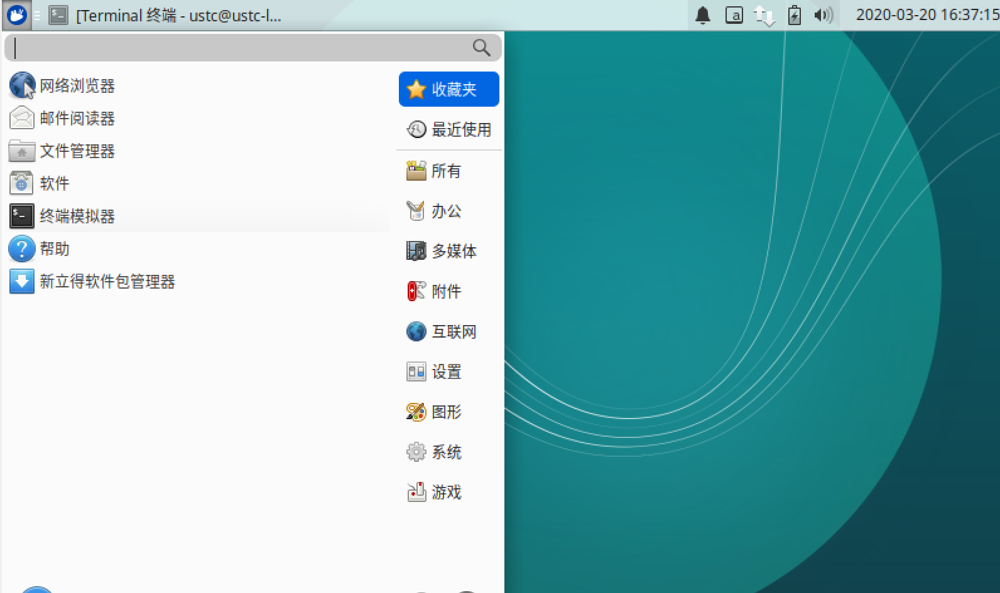
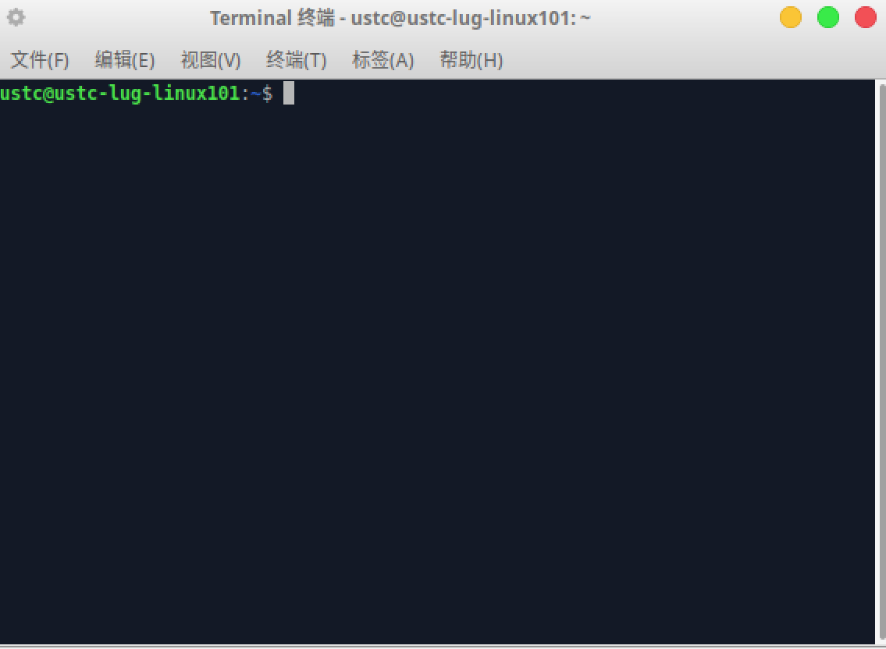

# 终端、SSH 与文件传输

## 命令行操作 {#shell}

### 为什么要用命令行 {#why-shell}

图形界面非常方便，为什么 Linux 的用户还热衷于命令行的使用呢？

#### 效率

使用命令行操作可以减少鼠标操作，我们经常可以使用一条命令来代替好几次的鼠标单击。例如如果我们想要移动某一个文件，我们要执行下面步骤：

- 打开文件所在的文件夹 `../source/`
- 打开目标文件夹 `../dest/`
- 从 `../source/` 文件夹拖拽文件 `file.txt` 到 `../dest/` 文件夹中

然而使用命令行，我们只需要执行一条指令。

```shell
$ mv ../source/file.txt ../dest/
```

可能在初学者看来，熟记这条指令并不容易，但是从长远上看，熟悉了命令行之后再加上有自动补全的 shell 程序，使用命令行可以节省大量时间。

#### 自动化脚本

!!! tips "提示"

	脚本的使用将在第六章详细讲解。

Shell 脚本可以帮助程序员自动执行重复的任务。例如我们想自动编译运行一个 C 语言程序 `main.c`，我们可以在该文件的目录新建一个脚本 `run.sh`.

两个文件分别下如内容。

```c
// main.c

#include <stdio.h>
int main() {
	printf("Hello world!\n");
	return 0;
}
```

```shell
# run.sh

gcc main.c -o main.out
./main.out
rm main.out
```

之后我们直接输入

```shell
$ sh run.sh
```

即可看到程序输出结果。

#### 节省资源

图形界面对资源的消耗是不可忽略的，在绝大部分的服务器中都没有使用图形界面，节约资源。

#### 使用命令行看上去很酷

影视作品中，操作命令行的总是技术高超的黑客。现在轮到你来操作命令行了，难道不是很酷的一件事情吗？

### 什么是 shell {#what-shell}

上面所说的命令行，实际上指的就是 shell。shell 其实就是一个程序，它可以接受键盘输入的命令，然后把命令交给系统执行。现在几乎所有的 Linux 发行版都提供了一个叫 bash 的 shell 程序，相当于传统 shell 的增强版。

### 如何打开 shell {#how-shell}

在图形界面中，我们需要另一个和 shell 交互的程序，叫做终端模拟器，简称「终端 (terminal)」。我们可以在「所有程序」找到它。



图 21. 终端在菜单的位置
{: .caption }

打开后如下图。



图 22. 终端界面
{: .caption }

### 几条简单的命令 {#shell-commands}

- `ls`: 列出目录的内容
- `cd`: 更改目录
- `pwd`: 查看当前所在的目录

更多的命令行操作我们将在第三章详细介绍。

#### 示例 1

```shell
$ pwd
```

会打印出当前所在的目录

```
/home/ustc
```

#### 示例 2

```shell
$ ls
```

会打印出当前目录的内容

```
Desktop Documents Music Pictures Public Templates Videos
```

#### 示例 3

```shell
$ cd Desktop
$ ls
```

进入桌面，并打印出桌面的内容。

```
hi.txt
```

!!! info "注意"

    显示内容与计算机文件状态有关，并不是每个人都会显示相同的内容。


## 终端 (Terminal) 与控制台 (Console)

还记得在 Unix 诞生之前由通用电器公司主持的 Multics 计划吗？对了，就是可以让用户把一套键盘显示器往墙上一插，直接连接到远端主机的计划。当时键盘和显示器连为一体，称为终端（terminal）。而主机自带的一套键盘与屏幕只能给系统管理员使用，称为控制台 (console)，用来输出启动 debug 信息（现在的 Linux 系统如果因故障而不得不进入单用户修复模式，则只有一个终端 `/dev/console` 开启）。

然而随着时代的发展，这种模式逐渐被家庭电脑的分布式主机取代，我们不需要，也没有多套终端了，只有显示器、键盘、鼠标。但是为了向前兼容性，我们需要假装这是一个（甚至多个）终端，所以一般发行版 `/dev` 目录下有 7 个终端 `tty1 ~ tty7`，通过 `ctrl + alt + F1 ~ F7` 切换键盘与显示器与哪个终端相对应。

再后来，随着时代发展，终端需要出现在图形界面上了，然而承载图形界面的也是终端，所以终端里的终端就需要终端模拟器来实现了。由此，出现在图形界面上的终端才叫终端模拟器。

**注意：终端不是 Shell，尽管它们经常被弄混淆。**

参考阅读: [你真的知道什么是终端吗？](https://www.linuxdashen.com/你真的知道什么是终端吗？)

## 壳层 (Shell)

但凡使用 Linux，必然要与之交互。广义上讲，能与用户交互的程序都符合 shell 的定义（比如图形界面可以识别鼠标位置信息，点击操作和键盘快捷键）。然而 Linux 本身以命令行工具为主，而 shell 狭义上就是命令行解释工具，即允许用户在一定程度上「说人话」来调用程序。

Shell 是非常重要的程序。如果发行版中根本没有 shell，用户便无法控制计算机了。

没有图形界面时，shell 一般为控制台 (tty) 的子进程，在图形界面上 shell 建立在虚拟终端 (pty, pseudo tty) 之上。顺带一提，`ssh` 的父进程也是一个 pty。

## SSH ([Secure Shell Protocol](https://en.wikipedia.org/wiki/Secure_Shell_Protocol))

### ssh & sshd

`ssh` 为客户端，可通过如下命令连接到远程服务器：

```shell
$ ssh user@host
```

`sshd` 为服务端，Linux 发行版往往会自动配置其开机启动并后台运行：

```shell
$ ps -ef | grep sshd
root       627     1  0 Mar30 ?        00:00:05 /usr/sbin/sshd -D
root       761   627  0 11:50 ?        00:00:00 sshd: hguandl [priv]
hguandl    767   761  0 11:50 ?        00:00:00 sshd: hguandl@pts/0
hguandl    845   768  0 11:50 pts/0    00:00:00 grep sshd
```

### 使用公钥登录

SSH 的登录需要授权，使用密码是最自然的想法。但是人也往往出于输入麻烦、难以记忆等原因，不会使用强力的密码，造成安全隐患。SSH 支持另一种登录方式——公钥，使用起来更加方便也更加安全。

用户首先生成一对公私钥，将公钥上传至服务器。用户登录时请求匹配公钥，如果匹配成功则可登入。

密码学方面的研究可以保证仅通过公钥是极难得出私钥的，目前常用的算法有两种——RSA 和椭圆曲线。

```shell
$ ssh-keygen -t ed25519 -a 100 -C "your comment"

$ ssh-keygen -t rsa -b 4096 -o -a 100 -C "your comment"
```


### scp (secure copy)

SSH 还支持传输文件，可以使用 `scp` 工具进行：

```shell
$ scp hello.txt user@host:/path/to/hello.txt
```

#### SSH config

使用配置文件可以简化命令。

```
# ~/.ssh/config

Host mirrors
    HostName mirrors.cra.moe
    Port 2333
    User hguandl
```

```shell
$ ssh mirrors

$ scp hello.txt mirrors:/path/to/hello.txt
```

## RSYNC

- 可以文件权限/断点续传/增量传输

```
$ rsync -vha /path/to/dirA /path/to/dirB

$ rsync -vha /path/to/dirA user@host:/path/to/dirB
```

- 常用于大量文件/软件同步（如镜像站）

```shell
$ rsync -aHvh --no-o --no-g --stats --exclude .~tmp~/ --safe-links --exclude dists/ --timeout=120 rsync://nanomirrors.s.tuna.tsinghua.edu.cn/ubuntu/ /data/mirrors-zfs/sync/ubuntu
```
